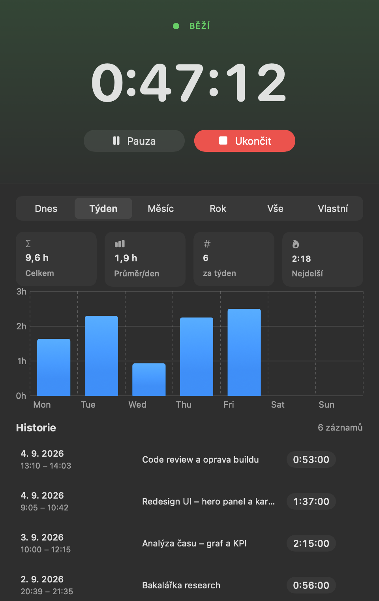
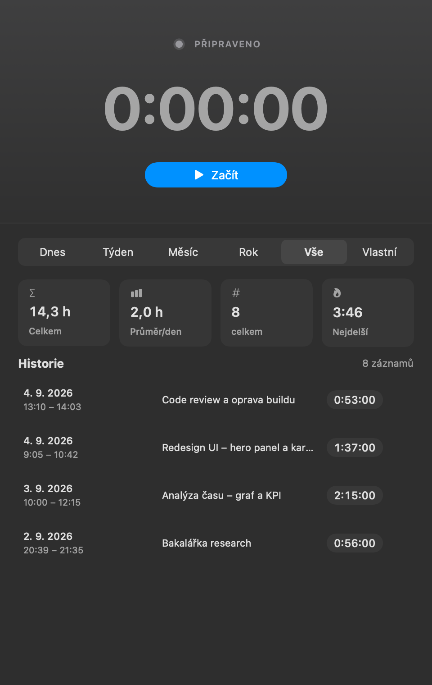

# Chrono

Menu bar stopky pro macOS s evidencí odpracovaného času. Spustíš stopky, pracuješ, po ukončení
napíšeš jednou větou co jsi dělal – a záznam se uloží do historie.

## Náhled

<p align="center">
  
  
</p>

## Co to umí

- **Stopky přímo v menu baru** – běžící čas vidíš nahoře v liště, ovládáš ho z rozbalovacího menu,
  hlavní okno mít otevřené nemusíš
- **Pauza a pokračování** – přestávka se do odpracovaného času nepočítá
- **Prompt na popis práce** – po stisku „Ukončit a uložit" se zeptá, co jsi dělal
- **Přehled a analýza** – vyber období (Dnes / Týden / Měsíc / Rok / Vše / vlastní rozsah) a uvidíš
  souhrn (celkem, průměr na den, počet, nejdelší) i sloupcový graf aktivity
- **Historie** – přehledné karty záznamů (datum, čas od–do, délka, popis), mazání s potvrzením
- **Export do CSV** – zvolené období jedním klikem do tabulky
- Data se ukládají **lokálně na tvém Macu** přes SwiftData, nikam se neposílají

## Požadavky

- macOS 15 (Sequoia) nebo novější

## Stažení hotové aplikace

1. Stáhni si nejnovější ZIP ze [sekce Releases](../../releases)
2. Rozbal ho a přetáhni `Chrono.app` do složky **Aplikace**
3. Při prvním spuštění tě macOS zastaví – viz níže

### macOS aplikaci nechce spustit

Aplikace není notarizovaná u Applu (na to je potřeba placený vývojářský účet), takže ji
Gatekeeper napoprvé zablokuje. Je to očekávané, ne chyba. Odblokuješ ji takhle:

**Postup přes nastavení:**
1. Zkus Chrono spustit, macOS ho odmítne
2. Otevři **Nastavení systému → Soukromí a zabezpečení**
3. Sjeď dolů, u hlášky o zablokovaném Chronu klikni na **Přesto otevřít**

**Nebo jedním příkazem v Terminálu:**
```bash
xattr -dr com.apple.quarantine /Applications/Chrono.app
```

Napodruhé už se aplikace spustí normálně.

## Build ze zdrojáků

Potřebuješ Xcode 16 nebo novější.

```bash
git clone https://github.com/smolip/Chrono.git
cd Chrono
open Chrono.xcodeproj
```

V Xcode dej **Cmd+R**. Xcode si projekt podepíše sám tvým lokálním certifikátem, nic nastavovat
nemusíš – jen v záložce *Signing & Capabilities* možná budeš muset vybrat svůj tým nebo nechat
zapnuté „Sign to Run Locally".

Build z příkazové řádky:
```bash
xcodebuild -project Chrono.xcodeproj -scheme Chrono -configuration Release build
```

## Licence

[MIT](LICENSE)
